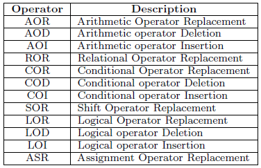

## 引言

本文是关于软件工程会议[ISSTA2017](http://conf.researchr.org/home/issta-2017)录用的论文“[Faster Mutation Analysis via Equivalence Modulo States](http://xueshu.baidu.com/s?wd=paperuri%3A%2858fc680748b07dfa0259884a40309fe8%29&filter=sc_long_sign&tn=SE_xueshusource_2kduw22v&sc_vurl=http%3A%2F%2Farxiv.org%2Fabs%2F1702.06689&ie=utf-8&sc_us=982844565878477910)”的个人阅读和分析，单纯用于个人阅读记录，观点和分析仅供参考,有些翻译少许生硬，可以参考英文解释。

## 背景介绍

本文是关于mutation testing的一个效率优化的工作，对于mutation testing不了解的可以移步Yue Jia和Mark Harman教授的survey工作“[An Analysis and Survey of the Development of Mutation Testing](http://ieeexplore.ieee.org/document/5487526/)”,这一篇survey对于mutation testing的发展和已有的研究工作都做了一个很好的梳理。借此机会这里简要来补充一下相关知识，mutation testing是一种通过对程序(可看做golden version)中人为插入一些错误（seeded faults）来构造新的程序变体（mutant），由于生成的mutant通常与原始程序表现不同，主要可以用来对于测试用例的质量进行衡量，是一个常用的metrics。

在此研究领域中，有几个不同维度的工作：

### 变异操作
变异操作(mutation operator)是指在原始程序中通过一些变换，例如改变语法操作等来对原始程序做一些修改，已有两大类的变异操作traditional operator和class operator，也可称为method-level和class-level operators这里在下面列出常用工具MuJava中支持的两大类operator的列表：

以最简单的AOR来举例，原始程序中包含一行简单的a=b+c语句，AOR的变异操作会对其中的算术运算符进行替换，将原始“a=b+c”替换成“a=b-c”,这是一个简单便于理解的例子。针对不同领域，有研究工作设计了不同的operator,以及针对不同operator的横向比较和研究。

### 变异操作次数
这里主要推荐Yue Jia教授的介绍higher order mutation testing的工作[Higher Order Mutation Testing](http://xueshu.baidu.com/s?wd=paperuri%3A%28256e59987845f8910d43dbee99522737%29&filter=sc_long_sign&tn=SE_xueshusource_2kduw22v&sc_vurl=http%3A%2F%2Fwww.sciencedirect.com%2Fscience%2Farticle%2Fpii%2FS0950584909000688&ie=utf-8&sc_us=15796804892534341782)，传统mutation testing为了方便分析错误，只允许每次插入一个fault，即只允许程序中一处发生mutate，higher order mutation testing提出允许程序中多次进行mutate并对其被kill难度、影响与检错能力进行了探究，并对多个错误点之间可能存在的coupling进行了分析，是一个很详细的工作。当然，大多数应用mutation testing的工作还是基于first order上面来做的。

### 生成的mutant的特点区分
ongoing。。。。

### mutant编译与运行优化
