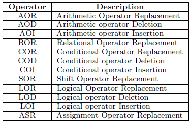
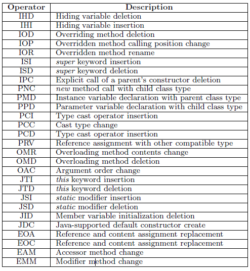

## 引言

本文是关于mutation testing的介绍篇，主要介绍一下基本的工作以及记录分享读过的一些好文章。

## 背景介绍

mutation testing是一种通过对程序(可看做golden version)中人为插入一些错误（seeded faults）来构造新的程序变体（mutant），用以模拟实际生活中程序中可能存在的bug。通常可以用其来对于测试用例的质量进行衡量，是一个常用的metrics，一般来说认为一个测试用例能够kill掉越多的mutant（mutation score越高），则认为该测试用例的检错能力更强。对于mutation testing不了解的可以移步Yue Jia和Mark Harman教授的survey工作“[An Analysis and Survey of the Development of Mutation Testing](http://ieeexplore.ieee.org/document/5487526/)”,这一篇survey对于mutation testing的发展和已有的研究工作都做了一个很好的梳理。

## 研究工作
在此研究领域中，主要有几个不同维度的工作：

### 1. 变异操作
变异操作(mutation operator)是指在原始程序中通过一些变换，例如改变语法操作等来对原始程序做一些修改，已有两大类的变异操作traditional operator和class operator，也可称为method-level和class-level operators这里在下面列出常用工具[MuJava](http://delivery.acm.org/10.1145/1140000/1134425/p827-ma.pdf?ip=114.212.81.253&id=1134425&acc=ACTIVE%20SERVICE&key=BF85BBA5741FDC6E%2E180A41DAF8736F97%2E4D4702B0C3E38B35%2E4D4702B0C3E38B35&CFID=956104855&CFTOKEN=90259377&__acm__=1499163920_8a2c80a29e178a0f4fe3841c2fd7e648)中支持的两大类operator的列表：

以最简单的AOR来举例，原始程序中包含一行简单的a=b+c语句，AOR的变异操作会对其中的算术运算符进行替换，将原始“a=b+c”替换成“a=b-c”,这是一个简单便于理解的例子，实际中其实method-level的变化大多也较为简单。针对不同领域，有研究工作设计了不同的operator，以及针对不同operator的横向比较和研究。

### 2. 变异操作次数
这里主要推荐Yue Jia教授的介绍higher order mutation testing的工作[Higher Order Mutation Testing](http://xueshu.baidu.com/s?wd=paperuri%3A%28256e59987845f8910d43dbee99522737%29&filter=sc_long_sign&tn=SE_xueshusource_2kduw22v&sc_vurl=http%3A%2F%2Fwww.sciencedirect.com%2Fscience%2Farticle%2Fpii%2FS0950584909000688&ie=utf-8&sc_us=15796804892534341782)，传统mutation testing为了方便分析错误，只允许每次插入一个fault，即只允许程序中一处发生mutate，higher order mutation testing提出允许程序中多次进行mutate并对其被kill难度、影响与检错能力进行了探究，并对多个错误点之间可能存在的coupling进行了分析，是一个分析地比较详细且全面的工作。当然，大多数应用mutation testing的工作还是基于first order上面来做的。

### 3. 生成mutant区分
下面介绍几种常常讨论到的mutant类型区分，当然这些概念并不是严格独立的，有兴趣可参考论文“[Threats to the Validity of Mutation-Based Test Assessment](http://discovery.ucl.ac.uk/1508136/1/ISSTA16.pdf)”。
#### Equivalent mutant
这一概念指的是尽管程序代码上有部分语法改动，但是实际改动之后与golden version的效果是一样的，也就是这样的mutant其实与golden version程序是完全一致的。例如，golden version与mutantA只有一行代码不同，其余部分完全一致（这里用first order来说明），golden version中该行代码为a=a+1，mutantA中将其改成a=a++，很容易就能看出，尽管两行代码语法不同，但实际都是对a进行加一操作，因此该mutantA与golden version在程序功能上完全一致，无论是什么测试用例都不可能将该mutant来kill掉（kill掉指的是某测试用例能够在mutant和golden version表现不同）。

推荐几份工作：

1. [Overcoming the Equivalent Mutant Problem: A Systematic Literature Review and a Comparative Experiment of Second Order Mutation](http://xueshu.baidu.com/s?wd=paperuri%3A%283e6cce8158c7abe27c9e8553b9ec64ee%29&filter=sc_long_sign&tn=SE_xueshusource_2kduw22v&sc_vurl=http%3A%2F%2Fieeexplore.ieee.org%2Fdocument%2F6613487%2F&ie=utf-8&sc_us=17936251164219202183);
2. [Trivial Compiler Equivalence](http://delivery.acm.org/10.1145/2820000/2818867/p936-papadakis.pdf?ip=114.212.81.253&id=2818867&acc=ACTIVE%20SERVICE&key=BF85BBA5741FDC6E%2E180A41DAF8736F97%2E4D4702B0C3E38B35%2E4D4702B0C3E38B35&CFID=956104855&CFTOKEN=90259377&__acm__=1499165914_ab10f5f1acdfb62eab3d314dc68f76e8).

#### Duplicated mutant
这一概念指的是mutant之间相互一致的情况，例如，某程序P利用已有的mutation testing工具可以生成100个mutant，从mutant0~mutant99，但是其实mutant1=mutant2=...mutant10，此时，尽管有100个mutant但实际种类只有某几种，有可能导致某一类的mutant所占数目较多的时候，对于实验结果有误导，并且使得实验结果不可控。这一类情况也是可能的，比如golden version代码是a=a+1，mutantA中代码改为a=a-1，mutantB中代码改为a=a--，这两个mutant的程序行为与golden version确实不同，但是mutantA和mutantB的程序行为就是一样的，若选择mutantA为有效mutant，则mutantB即为duplicate的。

#### Trivial mutant
通常是容易被测试用例kill的mutant，容易被检测出来，这部分mutant并不能够帮助很好地区分测试用例的质量与后续的改进。

#### Stubborn mutant
源程序基础上生成的mutant通常数量很多，不同的测试用例通常可以kill掉不同的mutant列表，但是有一部分mutant已有测试用例都没有办法kill，这一部分mutant可能是equivalent mutant，即无论是什么测试用例都没有办kill，当然也有可能是stubborn mutant即有希望被kill只是已有的测试用例不足以kill，需要设计更好的测试用例来覆盖有效地kill这些stubborn mutant(顽固变体)。已有工作通常专注于检测并排除equivalent mutant，以达到得到实际可以被kill的那部分测试用例。之前提到的Mike Papadakis的工作[Trivial Compiler Equivalence](http://delivery.acm.org/10.1145/2820000/2818867/p936-papadakis.pdf?ip=114.212.81.253&id=2818867&acc=ACTIVE%20SERVICE&key=BF85BBA5741FDC6E%2E180A41DAF8736F97%2E4D4702B0C3E38B35%2E4D4702B0C3E38B35&CFID=956104855&CFTOKEN=90259377&__acm__=1499165914_ab10f5f1acdfb62eab3d314dc68f76e8)，idea非常简单，简单点就是“编译后字节码和golden version一样的mutant一定是equivalent的”，但是效果很好。

#### Subsuming mutant
生成的mutant中，可能存在的一种模式，例如有两个mutant：mutantA与mutantB，只要测试用例能够kill掉mutantA，那么它一定能够kill掉mutantB，这其实就是一种类似的单项duplicate的mutant对，过多该对的冗余也可能造成测试结果的不稳定及不贴合实际，会导致得到误导的mutation score。

### 4. mutant编译与运行优化
通常情况下，一个很小的程序都有可能产生非常多的mutant，一方面是由于程序的代码行数影响，一方面是每一行都有很多种可以进行mutate的方式和效果，这些都可能导致mutant数目的庞大，有时候，即使有效地去除掉一些equivalent的mutant，依旧留下非常多的mutant，全部进行编译执行无疑是非常耗时间的，对于一些稍大型的程序也是几乎不可能做到的。

这里通常有几种方式进行选择来缓解压力，一种的sample的方式，例如随机选择某部分的mutant，或是有意识的选择dominate的mutant，或是选择较为推荐的operator产生的mutant，都有类似方面的工作，推荐一个介绍[dominate mutant](http://xueshu.baidu.com/s?wd=paperuri%3A%28cabf55adc3206503eb2ba1d53cecb552%29&filter=sc_long_sign&tn=SE_xueshusource_2kduw22v&sc_vurl=http%3A%2F%2Fdl.acm.org%2Fcitation.cfm%3Fid%3D2950322&ie=utf-8&sc_us=7845304006429058160)的工作，这一类也被称为lossy acceleration，因为这些办法都在加速的过程中损失了一部分的精度。

另一种则是对于编译与运行时刻可重用部分的优化。这一类问题的insight主要是每一个mutant与golden version在代码上的区分可能只有很小的部分，在实际的编译和运行上很多工作是重复的，因此并不需要每次都对于每一个生成的mutant都进行完整的编译和运行。

有三个典型的工作：

1. [Mutation schemata](http://xueshu.baidu.com/s?wd=paperuri%3A%282809f8063dde3aad31d92a09a21e7b76%29&filter=sc_long_sign&tn=SE_xueshusource_2kduw22v&sc_vurl=http%3A%2F%2Fdx.doi.org%2F10.1145%2F154183.154265&ie=utf-8&sc_us=12278191206072157693)：在编译时期进行优化加速，对于代码编译中可复用的部分可以只编译一次便可以进行复用，极大地减少mutant的编译时间；
2. Split-stream execution[1](https://www.computer.org/csdl/proceedings/icst/2016/1827/00/1827a320-abs.html)[2](http://xueshu.baidu.com/s?wd=paperuri%3A%289e82a4714ebac38be5968f0671d228b2%29&filter=sc_long_sign&tn=SE_xueshusource_2kduw22v&sc_vurl=http%3A%2F%2Fieeexplore.ieee.org%2Fdocument%2F7883390%2F&ie=utf-8&sc_us=16933628091378364782)[3](http://xueshu.baidu.com/s?wd=paperuri%3A%283cc51623c21499729b7a460298899a6f%29&filter=sc_long_sign&tn=SE_xueshusource_2kduw22v&sc_vurl=http%3A%2F%2Fonlinelibrary.wiley.com%2Fdoi%2F10.1002%2Fspe.4380210704%2Fpdf&ie=utf-8&sc_us=17805333039950884866)：对于每个mutation来说，实际mutate位置之前执行的代码其实都是和golden version完全一致的，可以只执行一次即可，每个mutant都可以减少实际的这部分执行时间；
3. Equivalence Modulo States[1](http://homes.cs.washington.edu/~mernst/pubs/state-infection-issta2014.pdf)[2](http://xueshu.baidu.com/s?wd=paperuri%3A%2858fc680748b07dfa0259884a40309fe8%29&filter=sc_long_sign&tn=SE_xueshusource_2kduw22v&sc_vurl=http%3A%2F%2Farxiv.org%2Fabs%2F1702.06689&ie=utf-8&sc_us=982844565878477910)：对于实际执行中，两个并不equivalent的mutant，在当前的输入下可能是表现一致的，例如a=b+1与a=b*2并不等价，但若当前状态是b=1则两者其实是一致的，这样的两个mutant其实只需要执行一个，就可以得到两个分别的结果。

### 5. 其他方面的探究
这里在列几份我读过的，觉得很有必要读一读的文章，主要是研究mutation testing插入的bug和real bug之间的联系。

1. [Is Mutation an Appropriate Tool for Testing Experiments?](http://xueshu.baidu.com/s?wd=paperuri%3A%2801758bb3969f24e63085fd29e82a9932%29&filter=sc_long_sign&tn=SE_xueshusource_2kduw22v&sc_vurl=http%3A%2F%2Fdl.acm.org%2Fcitation.cfm%3Fdoid%3D1062455.1062530&ie=utf-8&sc_us=8900140854107636296)
2. [Are mutants a valid substitute for real faults in software testing?](http://xueshu.baidu.com/s?wd=paperuri%3A%2891bd9ecd06648d03f776a6580df09dd8%29&filter=sc_long_sign&tn=SE_xueshusource_2kduw22v&sc_vurl=http%3A%2F%2Fdl.acm.org%2Fcitation.cfm%3Fid%3D2635929&ie=utf-8&sc_us=13584674297190939879)

## 结束语
本文是一个针对mutation testing的简单梳理，并列出了一些我认为入门需要了解的要点和一些我自己读过的高质量文章，当然受限于我的阅读面，很可能有很多高质量论文遗漏，若有机会也会及时的后续添加。